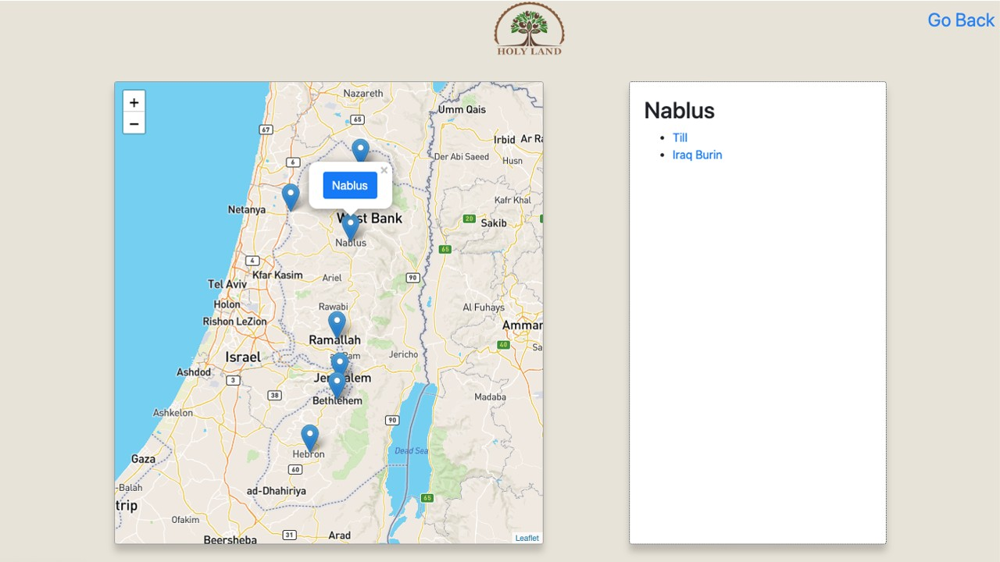
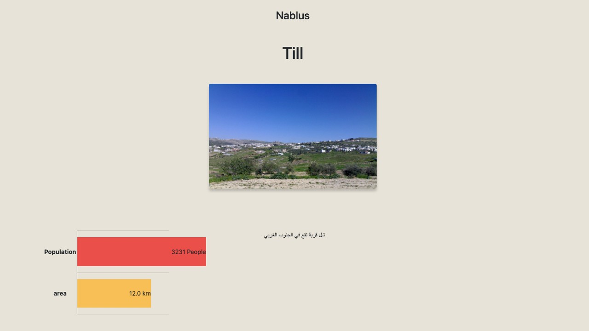
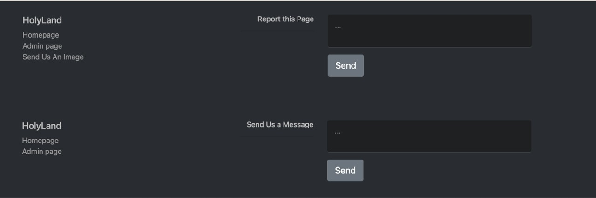
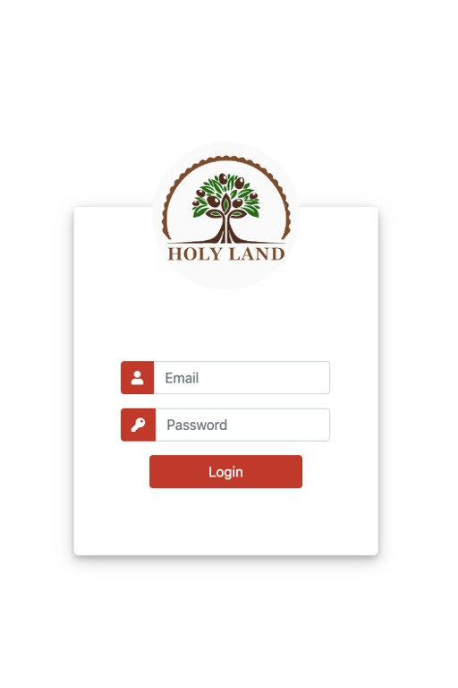
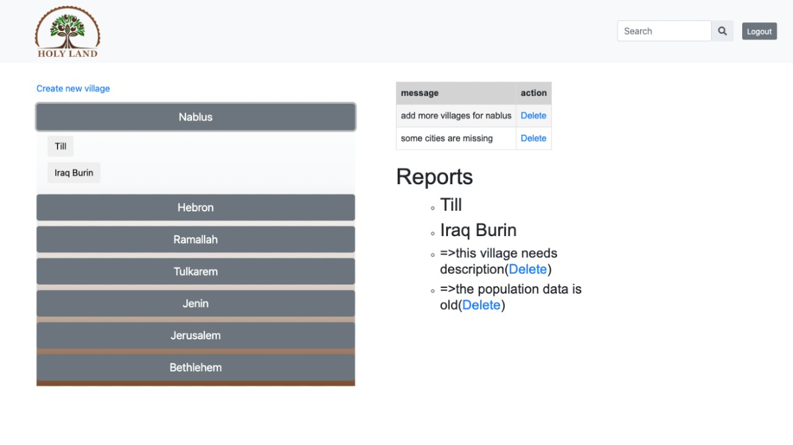
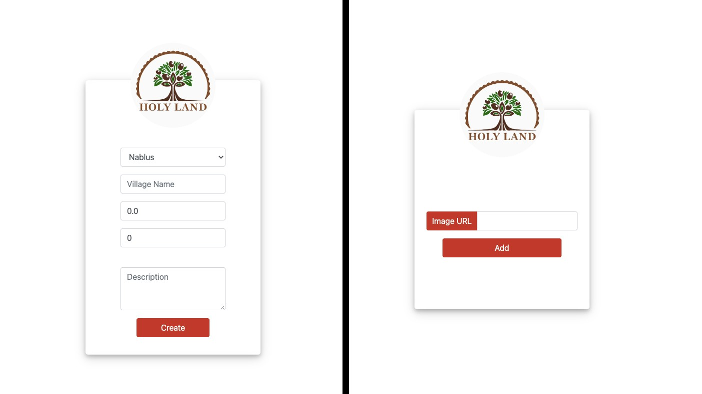

<p align="center">
	
</p>
<h1 align="center">
  Palestinian Village discovery app
</h1>

<p align="center">
      
</p>

<p align="center">

</p>
<p align="center">
    <a href="https://memberpress.com/wp-content/uploads/2020/12/coming-soon-page.jpg" target="blank">View Demo</a>
    ·
    <a href="https://github.com/OmarMHawash/userpanel/issues/new">Report Bug</a>
    ·
    <a href="https://github.com/OmarMHawash/userpanel/issues/new">Request Feature</a>
</p>

#### Welcome to Palestine HolyLand Discovery!

Our simple App uses a map api that displays cities, which leads to a list with the villages that belongs to it. You can view images, history and other info like population and area of each village.

The content is controlled from admin page, which manages cities and their villages. Also recieves tickets from users, who report the website or the village.

<h2 id="demo"> 🚀 Demo </h2>


Checkout The Demo: [Live Demo](https://memberpress.com/wp-content/uploads/2020/12/coming-soon-page.jpg)

<h2 id="markdown-navigation"> 🧭 Markdown Navigation </h2>

- [Markdown Navigation](#markdown-navigation)
  - [Quick Start](#quick-start)
  - [Features](#features)
  - [Resources](#resources)
  - [Preview](#preview)
  - [What's New?](#changes)

<h2 id="quick-start">🛠️ Installation Steps </h2>

### \*pre-requisites

- have **Java SDK** (1.8) and **Maven** plugin correctly installed on your machine.
- **MySql Server** for database operation ( Sql workbench required for data entry )
- Spring Tool Suite or any IDE of your taste.

## Steps

1. Clone or download the repository

```bash
git clone https://github.com/OmarMHawash/HollyLand
```

2. Import the project in your IDE

3. Run the app

<h2 id="features">🤯 Features & Functionalities </h2>

- User login and registration with authentication.
- Simple Homepage navigation and straightforward design for user experience
  ...

<h2 id="resources">💻 Technologies Used </h2>

- Map API [Leaflet](https://leafletjs.com/).

<h2 id="preview">🌁 Project showdown </h2>

### Home Page

<p align="center">
	
</p>

### Village Page

<p align="center">
	
</p>

## User Reporting

<p align="center">
	
</p>

## Logging In

<p align="center">
	
</p>

## Admin Panel

<p align="center">
	
</p>

## Admin Forms

<p align="center">
	
</p>

<h2 id="changes"> 🆕 What's New </h2>

### Latest Features

- ...

### Changelog

- ...
- ...

